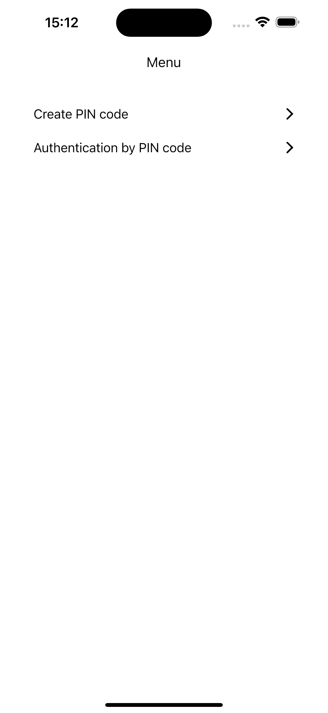
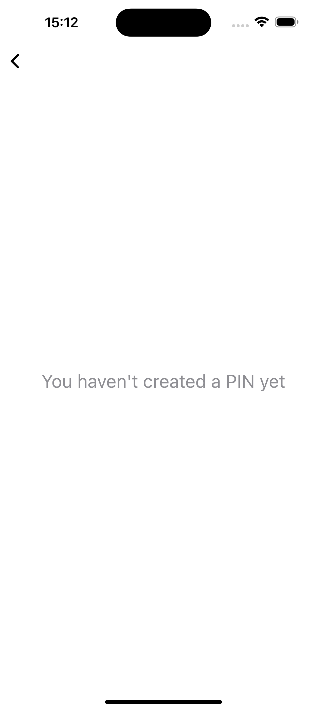
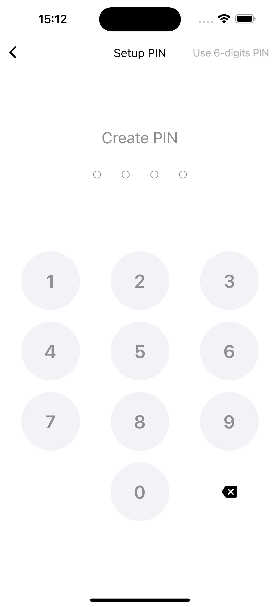
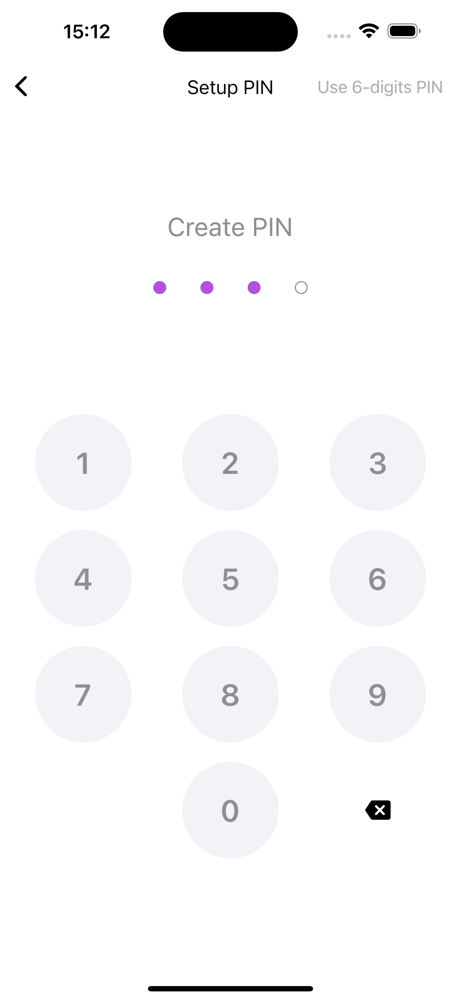
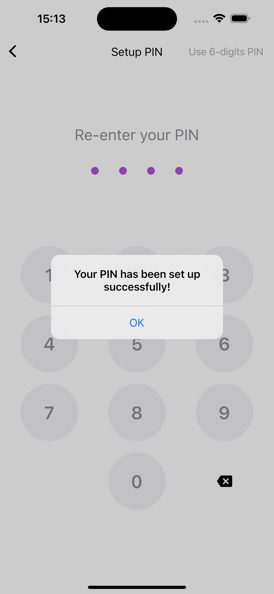
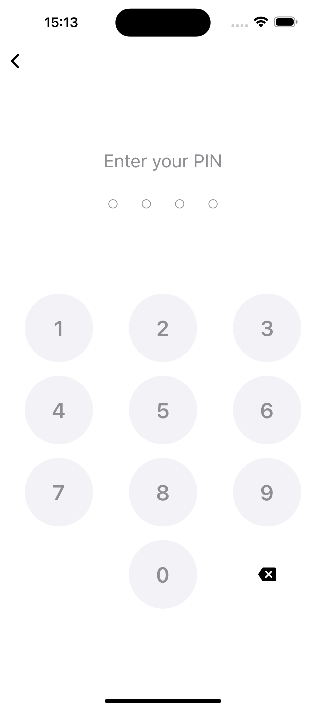
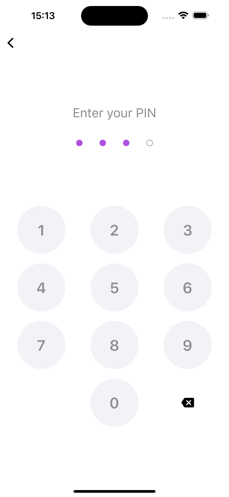
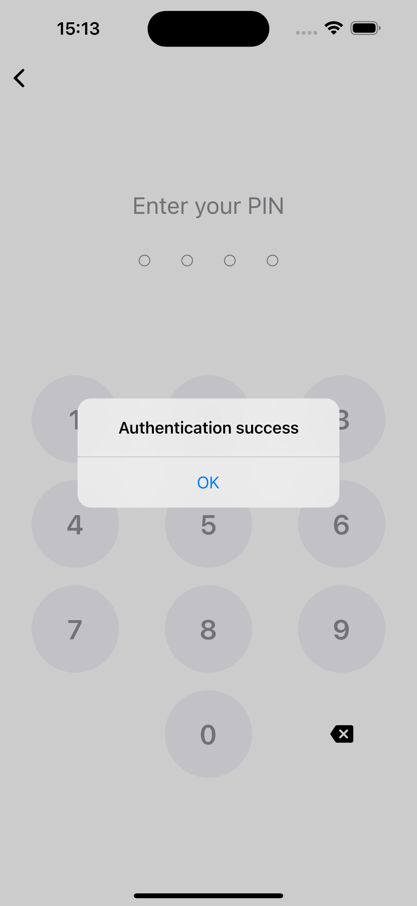
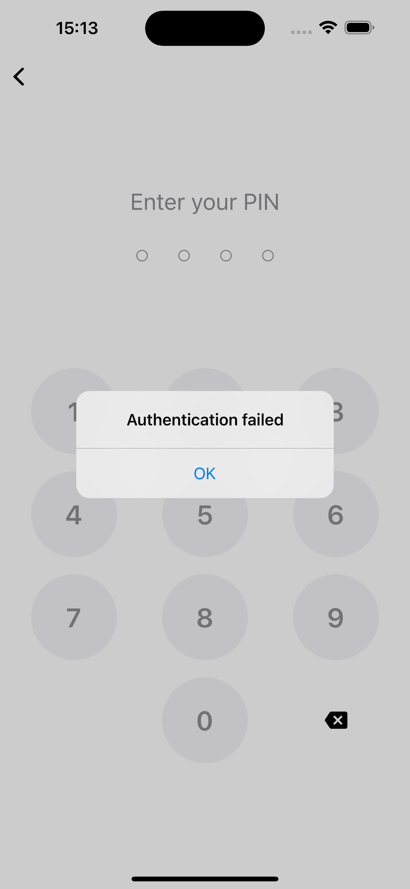

# PIN Authentication - Flutter Challenge

This challenge consists of implementing three screens: create PIN code screen, authentication by 
PIN code screen and menu screen.

Challenge developed by Jonny Eduardo Banach on March 26th 2023.

### Applied concepts

- BLoC pattern / Cubit;
- ListView;
- GridView;
- Data caching (Hive);

### Building and running the app

1. Clone the repository on your computer.
2. Connect a smartphone to the computer or start a simulator/ADV (Android Virtual Device).
3. Go to the project's root folder in the terminal and enter these commands:  `flutter build apk` and `flutter install`.
4. Open the "PIN Auth" application.

### Screenshots

| Description             | Image                                                           |
|-------------------------|-----------------------------------------------------------------|
| Menu Screen             |                    |
| PIN not created         |         |
| Create PIN (empty)      |        |
| Create PIN (filled)     |       |
| Re-enter PIN            |             |
| PIN does not match      |      |
| PIN set up successfully |  |
| Enter PIN (empty)       |         |
| Enter PIN (filled)      |        |
| Authentication success  |  |
| Authentication failed   |   |
